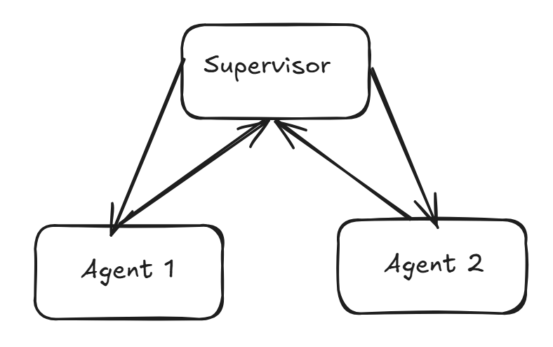

# Budget 2024 Intelligence Extraction & Multi-Agent Reasoning System

## Overview

This repository implements a complete document-understanding and reasoning pipeline that extracts, normalizes, and reasons over structured information from **Singapore Budget 2024**.  

The system is designed and implemented in three progressive stages:

1. **Document Extraction & Prompt Engineering** — Converts PDF pages into machine-readable text and extracts key fiscal data using LLM prompting.

2. **Tool-Calling & Reasoning Integration** — Integrates external tool calls (local MCP) for date normalization and performs temporal reasoning with structured output.

3. **Multi-Agent Supervisor System** — Implements a LangGraph-based supervisor-agent architecture to answer composite fiscal queries requiring both revenue and expenditure reasoning.

Each stage is modular, enabling future extension to APIs, Docker deployments, or service-oriented architectures.

---

## 1. Setup and Installation

### Prerequisites
- Python ≥ 3.10  
- Valid Google API key with Gemini access  
- A virtual environment (`venv` or `conda`) is strongly recommended.

### Installation Steps
```bash
git clone https://github.com/<your-username>/budget-2024-extraction.git
cd budget-2024-extraction

# Create and activate environment

```bash
python -m venv venv
source venv/bin/activate 

# Install dependencies

```bash
pip install -r requirements.txt

#Environment Configuration

Create a .env file in the project root:

```.env
GOOGLE_API_KEY="your-google-api-key"
LANGCHAIN_TRACING_V2="true"
LANGCHAIN_PROJECT="budget-2024-pipeline"
LANGCHAIN_API_KEY="your-langchain-api-key"

# Configuration File (config.yaml)

config.yaml defines document paths, model parameters, and runtime configuration.

```yaml
model: gemini-2.5-flash
extracted_text_path: "outputs/extracted_text.json"
target_pages_part_2:
  - 1
  - 36

# 2. Execution Workflow
## 2.1 Part 1 — Document Parsing and Extraction

### Step 1.1 Parse PDF

```bash
python -m chains.parse

Outputs:

- **outputs/extracted_text.json** — structured text content per page.

### Step 1.2 Extract Fiscal Fields

```bash
python -m chains.field_extraction_chain

Outputs Example:

- **outputs/extracted_field.json** containing:

```json
{
  "corporate_income_tax_2024_billion": 28.03,
  "corporate_income_tax_yoy_percent": 5.8,
  "total_topups_2024_billion": 2.0,
  "operating_revenue_taxes_list": ["Corporate Income Tax", "Personal Income Tax", "GST"],
  "latest_actual_fiscal_position_billion": 3.6
}

## 2.2 Part 2 — Date Normalization and Reasoning

```bash
python -m chains.normalize_date_chain

This step calls a FastMCP local server tool normalize_date to convert textual dates into ISO format.

Outputs Example:

```json
[
  {"original_text": "Distributed on Budget Day: 16 February 2024", "normalized_date": "2024-02-16"},
  {"original_text": "Estate Duty abolished with effect from 15 February 2008", "normalized_date": "2008-02-15"}
]

Using structured prompting, each normalized date is compared against a reference (2024-01-01) and classified as:

- Expired — date has passed

- Upcoming — date is in the future

- Ongoing — currently active

## 2.3. Part 3 — Multi-Agent Supervisor Q&A

```bash
python -m chains.qa_chain --query "What are the key government revenue streams, and how will the Budget for the Future Energy Fund be supported?"

- This command launches a LangGraph-based multi-agent system where:

- The Supervisor Agent orchestrates the conversation.

- The Revenue Agent focuses on identifying and structuring government revenue.

- The Expenditure Agent analyzes spending, fund allocations, and specific initiatives.

Final output is printed to the command line.

# 3. System Architecture

The pipeline is structured into modular chains and agents:

- Parsing Chain — Converts unstructured PDF data into structured JSON.

- Field Extraction Chain — Uses LLM-based schema extraction with per-page prompts.

- Normalization Chain — Integrates local MCP tool calls for date normalization and performs logical reasoning.

- Q&A Chain (Multi-Agent) — Employs LangGraph supervisor pattern to decompose and synthesize answers.

# 4. Design Considerations and Justifications
## Part 1.1 – PDF Parsing Strategy

Chosen Tools:

**pdfplumber**
 for text, table, and layout parsing.

Gemini OCR fallback for image-based or scanned pages.

Justification:

- pdfplumber provides granular control over table and text boundaries, enabling accurate extraction of tabular fiscal data.

- Unlike PyMuPDF or Docling, which optimize for text throughput, pdfplumber preserves structural fidelity—critical for government reports with multi-column layouts.

- Gemini OCR ensures completeness when textual parsing fails, particularly for embedded charts or scanned annexes.

- Empirical - works well for given purpose

Trade-offs:

- Slightly slower parsing than PyMuPDF but yields higher fidelity and fewer misreads.

- OCR fallback increases latency but guarantees full coverage of document content.

## Part 1.2 – Prompt Engineering and Extraction Logic

Prompting Approach:

- A dedicated extraction prompt runs per page.

- Outputs are merged into a unified JSON file (extracted_field.json).

Rationale:

- Avoids context truncation in long documents.

- Enables parallel or incremental processing of sections (future-scalable for multi-threaded or distributed runs).

- Long documents often lose mid-section fidelity when fed as a single context window, especially if fields are sparsely located.

LLM:

- ChatGoogleGenerativeAI(model="gemini-2.5-flash") used for both free-form reasoning and structured schema extraction, and also due to its long context window.

- Specific schema needs to be provided to each call to enforce it, or gemini would not confirm to json structure, and this might require additional invokation.

# Part 2 – Tool-Calling and Reasoning Integration

## Step 2.1 – Normalization via Local MCP

A normalize_date tool is exposed locally using FastMCP, executed via subprocess.

- Ensures deterministic ISO date conversion independent of LLM parsing noise.

## Step 2.2 – Temporal Reasoning

- Prompt directs the LLM to reason over normalized dates relative to 2024-01-01.

- Enforces structured output with a Pydantic schema

Advantages:

- Deterministic, schema-safe outputs.

- Reasoning aligned to objective date reference ensures reproducibility.

# Part 3 – Multi-Agent Supervisor System

The system employs a supervisor pattern implemented in LangGraph.

Agent Roles:

- Revenue Agent: Extracts and analyzes all government income sources (Corporate Tax, GST, Excise, etc.).

- Expenditure Agent: Interprets expenditure allocations and identifies funding mechanisms (e.g., Future Energy Fund, Infrastructure Support).

Supervisor Responsibilities:

- Parse user query.

- Route sub-queries to agents based on domain relevance.

- Aggregate responses into a cohesive answer.

## Comparison: Fan-in/Fan-out vs Supervisor Pattern

In this project, two multi-agent orchestration strategies were considered: **Fan-in/Fan-out** and the **Supervisor Pattern**. Both have distinct strengths and trade-offs that influence scalability, accuracy, and interpretability.

### Fan-in/Fan-out Pattern


This approach decomposes a complex query into smaller sub-tasks through a router or decomposer. Each sub-task is dispatched to specialized agents that run in parallel. The results are then aggregated by an aggregator model to form the final answer.  

It is highly structured and deterministic, allowing parallel execution and efficient handling of well-defined problems. However, its rigidity can lead to missed context if the router fails to allocate subtasks correctly. The absence of a review loop also means that partial or incomplete results might go unnoticed. Fan-in/fan-out patterns are best suited for pipelines where sub-tasks are independent, and the decomposition logic is fixed (for example, extraction of multiple unrelated entities).

### Supervisor Pattern



The supervisor pattern introduces a central coordinating agent that maintains reasoning control throughout the workflow. The supervisor dynamically decides which specialized agent to call, interprets intermediate responses, and iteratively refines the conversation until a complete answer is formed.  

This approach offers interpretability and flexibility, allowing dynamic re-prompting and oversight of agent performance. However, it can be less parallel and may risk missing simultaneous sub-tasks if not explicitly designed for concurrency. It is ideal for open-ended reasoning tasks where interpretive understanding and contextual synthesis are more important than raw throughput.

This is however more challenging to implement with Langgraph because of out the box, langgraph implemetnation of agent is simplistic and even with detailed context engineering, it is difficult to instruct the agent to address multiple parts of the question. There could be other design options, such as attaching a decompostion tool to the agent, but this proves unable to achieve good results either. It might be easier to implement with crewai, but langgraph is utilized (with customization) for ease of telementry.


### Chosen Approach

This project adopts the **Supervisor Pattern**. The reasoning tasks—identifying revenue streams and explaining how the Future Energy Fund will be supported—require interpretive synthesis across multiple fiscal dimensions. The supervisor model provides traceable, iterative reasoning, ensuring that both revenue and expenditure perspectives are considered before producing the final comprehensive answer.

The supervisor is a custom-made agent with the following logic:

- It takes in all the previous messages and states, determining the next step, including which agent to call.
- The next step is “finish” if the terminal condition is met. The terminal condition is determined by the LLM — either by fully answering the question and calling all tools, or by reaching `max_loop`.
- Its main job is routing, and at no point in time is it allowed to answer the question directly.

### Revenue and Expenditure 

There are also multiple approaches for the agent:
- Including the full document in the context
- Include only the extracted fields from the previous step into the context
- Perform a search for the pages which contain either revenue or expenditure information.

The most thorough method is a search. However, there are many challenges, since this task is not a ranking task but an extractive summmarization, that means that you have to go through all the parts of the documents to extract all relevant parts. Therefore it is difficult to utilize fuzzy or embeddings search as this would return a ranked list (a less accurate threshold can be utilized). 

Therefore, keyword search is utilized (case insensitive) using regex, with the agent prompted to try different keywords. However, this can be further improved upon (hybrid search, stemming and lemminization, training a small classifier etc).


## Observability

Langsmith is used for tracing LLM outputs. It connects to langchain cloud (or alternatively langsmith deployed on native cluster).

There are other options like opentelementry for local tracing.

# 5. Output Artifacts

Each stage in the pipeline produces structured outputs for traceability and verification.

**Part 1.1 – Parsing**

Generates `extracted_text.json`, containing parsed text and tables from each PDF page.

**Part 1.2 – Field Extraction** 

Produces `extracted_field.json`, summarizing key fiscal metrics such as corporate income tax, top-ups, tax list, and fiscal position.

**Part 2 – Date Normalization and Reasoning** 

Creates or updates `normalized_part2.json`, listing extracted dates, their ISO-normalized forms, and reasoning status (“Expired,” “Ongoing,” or “Upcoming”).

**Part 3 – Multi-Agent Supervisor**
 
Prints the final synthesized answer to the console, combining revenue and expenditure insights into a cohesive fiscal summary.

# 6. Future Work

- Expose pipeline as REST or gRPC API.

- Containerize via Docker and orchestrate with Cloud Run or ECS.

- React frontend

- Context management - summarization of context to scale context for multi-dialogue if required.

- A small classifier or summarizer trained to extract information from documents